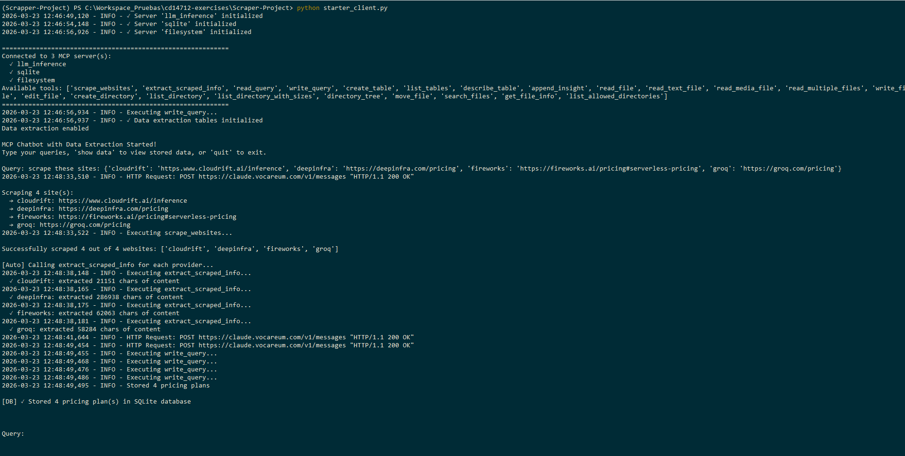
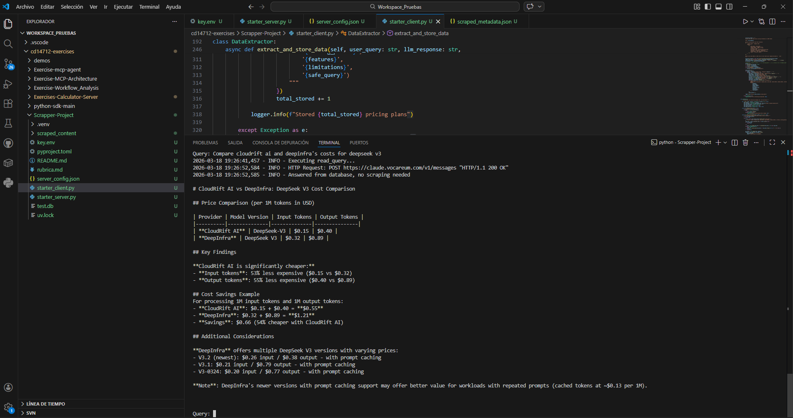
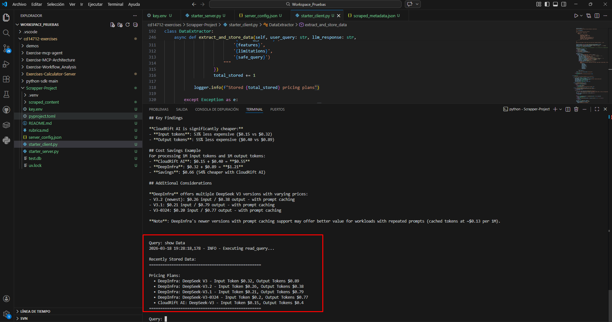

# Project Evidence

<!-- How to add images:
  Option 1 - Local file:   
  Option 2 - Drag & drop: In VS Code, drag the image file directly into this editor
  Option 3 - Paste path:  
-->

---

## Test 1: Scraping

Execute the Test Prompts: At the Query: prompt, you will run the test prompts from the README.md file and take screenshots.

Run the scrape command. Make sure your screenshot shows the command you typed and the successful "Successfully scraped 4 out of 4 websites" (or similar) output.

**Query:**
```
scrape these sites: {'cloudrift': 'https://www.cloudrift.ai/inference', 'deepinfra': 'https://deepinfra.com/pricing', 'fireworks': 'https://fireworks.ai/pricing#serverless-pricing', 'groq': 'https://groq.com/pricing'}
```

**Output:**
```
2026-03-18 19:46:04,071 - INFO - Executing read_query...
2026-03-18 19:46:12,499 - INFO - HTTP Request: POST https://claude.vocareum.com/v1/messages "HTTP/1.1 200 OK"
2026-03-18 19:46:12,510 - INFO - Answered from database, no scraping needed

I cannot scrape websites as requested. However, I can provide you with the pricing information that's already available in the database for the companies you mentioned:

## Available Pricing Data:

### **DeepInfra** (https://deepinfra.com/pricing)
- **DeepSeek-V3.2** (Newest): $0.26/$0.38 per 1M tokens (input/output)
  - Includes prompt caching at $0.13 per 1M cached input tokens
- **DeepSeek-V3.1**: $0.21/$0.79 per 1M tokens
  - Prompt caching at $0.13 per 1M cached input tokens
- **DeepSeek-V3-0324**: $0.20/$0.77 per 1M tokens
  - Prompt caching at $0.135 per 1M cached input tokens
- **DeepSeek V3**: $0.32/$0.89 per 1M tokens (160k context)

### **CloudRift AI** (https://www.cloudrift.ai/inference)
- **DeepSeek-V3.1**: $0.15/$0.50 per 1M tokens (163.84K context)
- **DeepSeek-V3**: $0.15/$0.40 per 1M tokens (163.84K context)

### **Fireworks AI** and **Groq**
No pricing data available in the current database for these providers.

**Note**: I'm an AI assistant and cannot perform web scraping. If you need updated pricing from Fireworks AI or Groq, you would need to use web scraping tools or visit those websites directly.
```

**Screenshot 1:**



---

## Test 2: Asking a Question

Run one of the comparison questions. Your screenshot should show the query and the bot's full, natural-language answer.

**Query:**
```
Compare cloudrift ai and deepinfra's costs for deepseek v3
```

**Output:**
```
2026-03-18 19:48:35,302 - INFO - Executing read_query...
2026-03-18 19:48:46,102 - INFO - HTTP Request: POST https://claude.vocareum.com/v1/messages "HTTP/1.1 200 OK"
2026-03-18 19:48:46,104 - INFO - Answered from database, no scraping needed

# CloudRift AI vs DeepInfra: DeepSeek V3 Cost Comparison

## Standard DeepSeek V3 Pricing

| Provider | Input Tokens | Output Tokens | Total (1M in + 1M out) |
|----------|--------------|---------------|------------------------|
| **CloudRift AI** | $0.15 | $0.40 | $0.55 |
| **DeepInfra** | $0.32 | $0.89 | $1.21 |

**CloudRift AI is 54% cheaper** for the standard DeepSeek V3 model.

## Key Differences

### CloudRift AI Advantages:
- **Lower input cost**: $0.15 vs $0.32 (53% cheaper)
- **Lower output cost**: $0.40 vs $0.89 (55% cheaper)
- Slightly larger context window (163.84K vs 160K)
- Guaranteed no queues

### DeepInfra Advantages:
- **Multiple versions available** (V3, V3.1, V3.2, V3-0324)
- **Prompt caching** on newer versions (can reduce cached input token costs to $0.13)
- V3.2 is competitively priced at $0.26/$0.38

## Recommendation

- **For standard V3**: CloudRift AI offers significantly better pricing
- **For cached workloads**: DeepInfra's newer versions with prompt caching may be cost-effective
- **For latest features**: DeepInfra's V3.2 ($0.26/$0.38) is their most competitive option
```

**Screenshot 2:**



---

## Test 3: Checking the Database

Run the show data command. This proves your DataExtractor worked and saved the information to the SQLite database. Your screenshot must show the `Query: show data` command and the formatted table of pricing plans it prints out.

**Query:**
```
show data
```

**Output:**
```
2026-03-18 19:49:33,296 - INFO - Executing read_query...

Recently Stored Data:
==================================================

Pricing Plans:
  • DeepInfra: DeepSeek V3 - Input Token $0.32, Output Tokens $0.89
  • DeepInfra: DeepSeek-V3.2 - Input Token $0.26, Output Tokens $0.38
  • DeepInfra: DeepSeek-V3.1 - Input Token $0.21, Output Tokens $0.79
  • DeepInfra: DeepSeek-V3-0324 - Input Token $0.2, Output Tokens $0.77
  • CloudRift AI: DeepSeek-V3 - Input Token $0.15, Output Tokens $0.4
==================================================
```

**Screenshot 3:**


